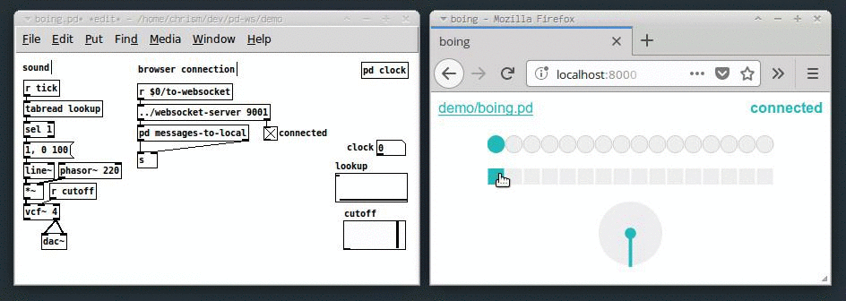

Communicate between Pure Data & web browser over a websocket.

Build browser based user interfaces for Pure Data DSP patches.

### tl;dr

### What

### Use

### Acknowledgement

Based on the excellent [Websocket-Server-in-a-Patch by Chris McCormic](https://github.com/chr15m/pd-ws).
